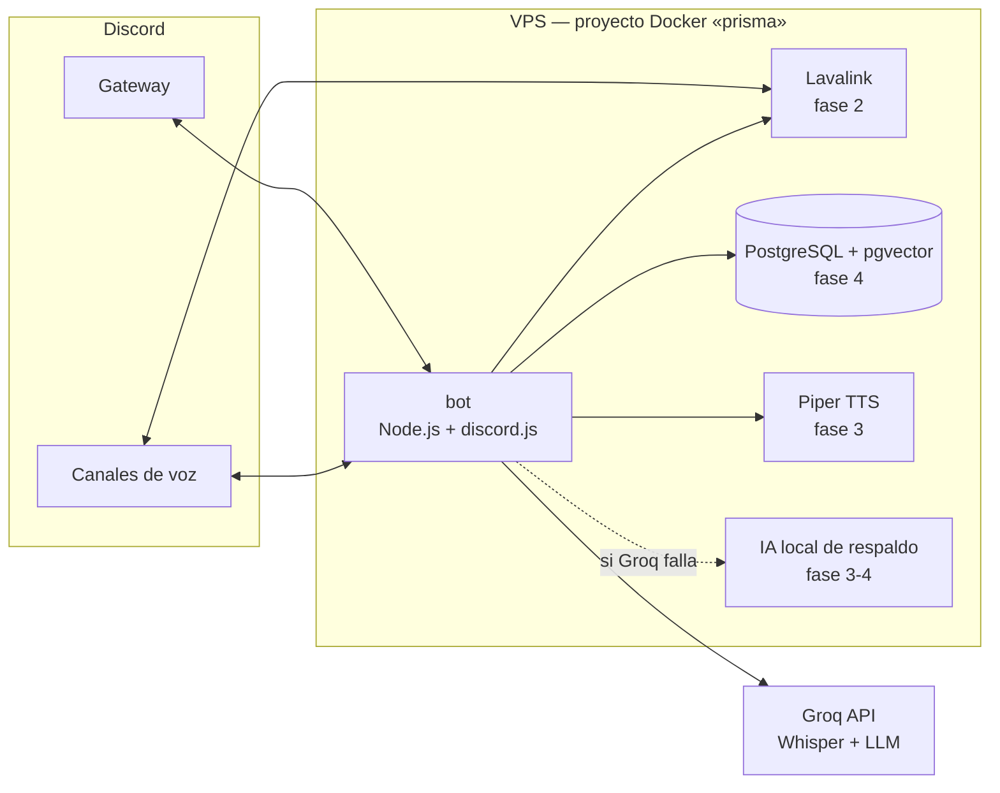
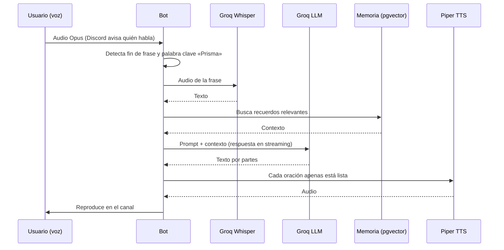

# Arquitectura

## Visión general

Prisma es un único proceso Node.js (el **bot**) que se conecta al Gateway de Discord. A medida que se sumen funciones, se apoyará en servicios auxiliares, todos dentro del mismo proyecto Docker `prisma` y aislados del resto de la VPS.



Las líneas punteadas y los servicios marcados con fase todavía no existen.

## Estructura del código

```
src/
├── index.ts               Punto de entrada: configuración, cliente, eventos y apagado ordenado
├── config.ts              Variables de entorno validadas con Zod (falla rápido si falta algo)
├── logger.ts              Logs estructurados con pino (JSON en producción)
├── version.ts             Versión leída de package.json
├── health.ts              Latido en archivo para el HEALTHCHECK de Docker
├── healthcheck.ts         Script que ejecuta Docker para saber si el bot está vivo
├── commands/
│   ├── types.ts           Contratos Command y BotContext
│   ├── index.ts           Registro central de comandos
│   └── *.ts               Un archivo por comando
├── events/
│   ├── ready.ts           Al conectar: seguridad de servidores y registro de comandos
│   └── interactionCreate.ts  Despacho de slash commands con manejo de errores
└── ui/
    └── embeds.ts          Colores y embeds con la identidad de Prisma
```

## Decisiones clave del diseño

- **Un solo servidor.** Prisma solo responde en `DISCORD_GUILD_ID` y abandona cualquier otro servidor al que lo inviten. Los comandos se registran en ese servidor (no globales), así que los cambios se ven al instante.
- **Contexto inyectado.** Los comandos reciben un `BotContext` (configuración, logger, registro de comandos) en lugar de importar variables globales. Esto los hace fáciles de testear y deja un punto único para sumar servicios (música, memoria, IA).
- **Fallar rápido.** La configuración se valida al arrancar; un error de configuración corta el proceso con un mensaje claro en lugar de fallar a mitad de camino.
- **Salud sin puertos.** El estado del bot se informa a Docker escribiendo un latido en `/tmp`, sin abrir ningún puerto HTTP.
- **Errores contenidos.** Un comando que falla responde un mensaje amable al usuario y queda registrado en el log; no tumba el bot. Una excepción no capturada sí termina el proceso, porque el estado es desconocido, y Docker lo reinicia limpio.

## Pipeline de voz (diseño previsto para la fase 3)



La meta de latencia es de 1 a 2 segundos desde que el usuario termina de hablar hasta que Prisma empieza a responder.
